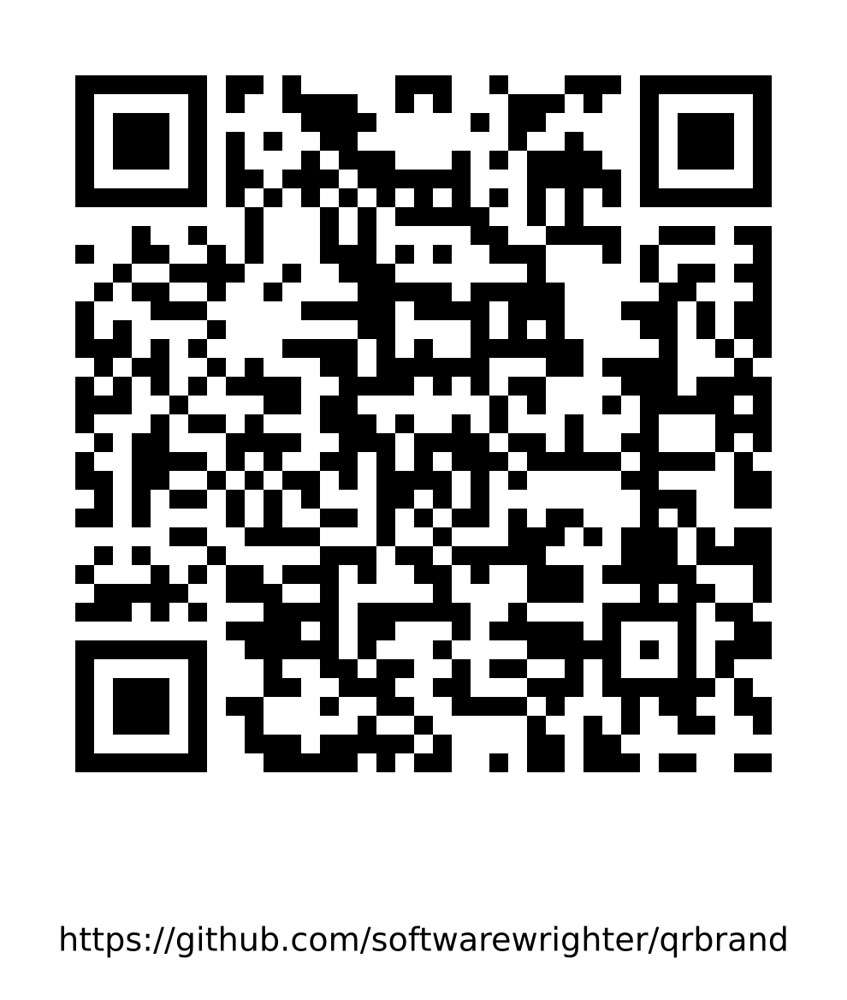

# qrbrand

A personal vibe-coded Rust CLI tool for generating scannable QR codes with optional logo overlays and URL text rendering.


*Generated with: `qrbrand --url "https://github.com/softwarewrighter/qrbrand" --show-url`*


*Example with logo overlay*

## Features

- Generate QR codes from URLs with high error correction
- Overlay logos/images in the center of QR codes
- Add white plates behind logos for better scan reliability
- Render URL text below QR codes with embedded font
- Customizable QR size, quiet zone, and logo scaling

## Installation

### Prerequisites

- Rust and Cargo (install via [rustup](https://rustup.rs/))
- **Font Requirement**: The `DejaVuSans.ttf` font file must be present in the `assets/` directory for the URL text rendering feature to work. This font is included in the repository.

### Build from Source

```bash
# Clone the repository
git clone https://github.com/softwarewrighter/qrbrand.git
cd qrbrand

# Build the binary
cargo build --release

# The binary will be available at ./target/release/qrbrand
```

### Install Globally

```bash
cargo install --path .
```

## Usage

### Basic QR Code Generation

```bash
# Generate a QR code from a URL
qrbrand --url "https://github.com/softwarewrighter/speed-kings"

# Specify output file
qrbrand --url "https://example.com" --out "my-qr.png"
```

### QR Code with Logo

```bash
# Add a logo/image to the center of the QR code
qrbrand --url "https://example.com" --image "logo.png"

# Customize logo size (0.10-0.30 recommended)
qrbrand --url "https://example.com" --image "logo.png" --logo-scale 0.15

# Disable white plate behind logo
qrbrand --url "https://example.com" --image "logo.png" --logo-plate false
```

### QR Code with URL Text

```bash
# Display URL text below the QR code
qrbrand --url "https://example.com" --show-url
```

### Advanced Options

```bash
# Custom QR size (default: 1024)
qrbrand --url "https://example.com" --size 2048

# Adjust quiet zone border (default: 4)
qrbrand --url "https://example.com" --quiet 6

# Combine all features
qrbrand \
  --url "https://example.com" \
  --image "logo.png" \
  --out "branded-qr.png" \
  --size 1024 \
  --quiet 4 \
  --logo-scale 0.20 \
  --logo-plate true \
  --logo-pad 0.18 \
  --show-url
```

## Command Line Options

```
USAGE:
    qrbrand [OPTIONS] --url <URL>

OPTIONS:
    -u, --url <URL>                    URL to encode (e.g. https://github.com/softwarewrighter/speed-kings)
    -i, --image <IMAGE>                Optional center image/logo (png/jpg)
    -o, --out <OUT>                    Output PNG path [default: qrcode.png]
        --size <SIZE>                  Size (in pixels) of the QR portion (square). Higher is better for video.
                                       [default: 1024]
        --quiet <QUIET>                Quiet zone size in modules (border). 4 is the usual minimum. [default: 4]
        --logo-scale <LOGO_SCALE>      Logo size as a fraction of QR width (0.10..0.30 recommended) [default: 0.20]
        --logo-plate <LOGO_PLATE>      Draw a white plate behind the logo for scan reliability [default: true]
        --logo-pad <LOGO_PAD>          Extra padding around the logo plate (fraction of logo size) [default: 0.18]
    -s, --show-url                     Render the URL as text below the QR code [default: false]
    -h, --help                         Print help
```

## Development

### Running Tests

```bash
# Run all tests
cargo test

# Run tests with verbose output
cargo test -- --nocapture
```

### Code Quality

```bash
# Run clippy for linting
cargo clippy -- -D warnings

# Format code
cargo fmt
```

### Building for Release

```bash
cargo build --release
```

## Project Structure

```
qrbrand/
├── Cargo.toml          # Rust project configuration
├── src/
│   └── main.rs        # Main CLI application
├── assets/            # Font files for text rendering
├── LICENSE            # MIT License
└── README.md          # This file
```

## Dependencies

- `clap`: Command line argument parsing
- `qrcode`: QR code generation
- `image`: Image processing and manipulation
- `anyhow`: Error handling
- `url`: URL parsing and validation
- `rusttype`: Font rendering for URL text

## License

MIT License - see [LICENSE](LICENSE) file for details.

Copyright (c) 2026 Michael A. Wright